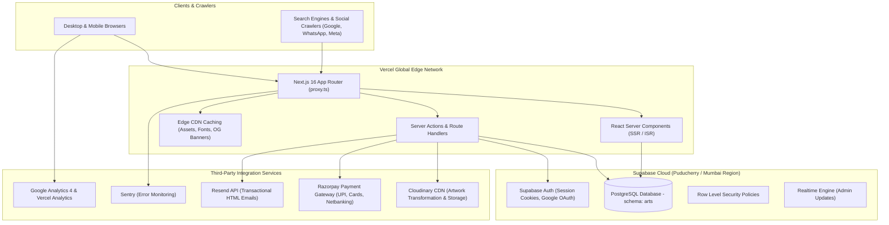
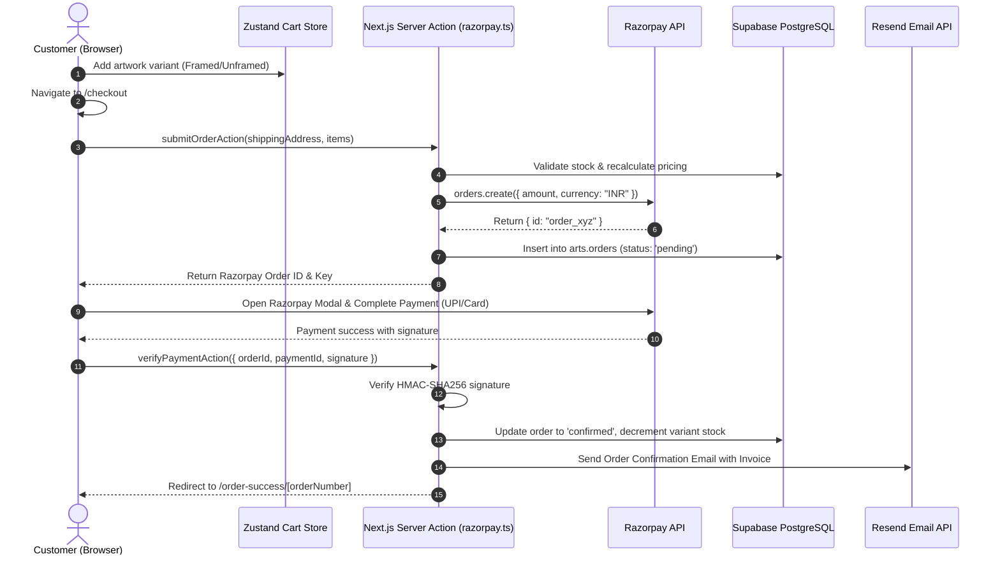
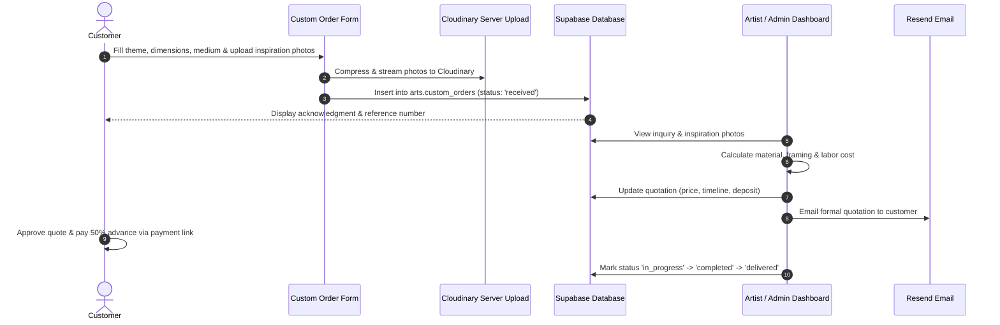
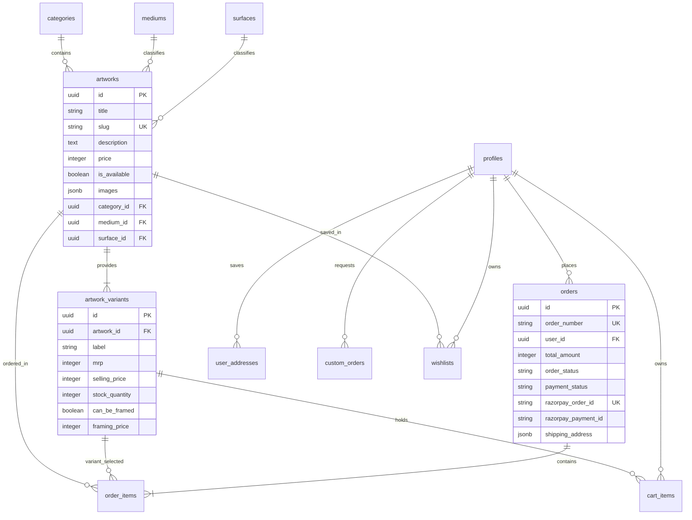

# 🏗️ Anjori Arts — Comprehensive System Design

> **Version:** 2.0.0  
> **Architecture:** Next.js 16 App Router + Supabase PostgreSQL + Vercel Edge  
> **Last Updated:** September 2026  
> **Status:** Production Ready  

---

## Table of Contents

1. [Executive Overview & Business Mission](#1-executive-overview--business-mission)
2. [Architecture Overview](#2-architecture-overview)
3. [Technology Stack](#3-technology-stack)
4. [Folder & Component Structure](#4-folder--component-structure)
5. [Feature Matrix & Implementation Status](#5-feature-matrix--implementation-status)
6. [Core User Journeys & Sequence Flows](#6-core-user-journeys--sequence-flows)
7. [Database Architecture & Security Model](#7-database-architecture--security-model)
8. [Performance, SEO & Accessibility Standards](#8-performance-seo--accessibility-standards)
9. [Operational Cost Model](#9-operational-cost-model)
10. [Future Roadmap](#10-future-roadmap)

---

## 1. Executive Overview & Business Mission

### What is Anjori Arts?

Anjori Arts is a bespoke **direct-to-consumer (D2C) Indian art e-commerce platform** created for professional artist **Jyotsna Sharma**. The platform serves three fundamental purposes:
1. **Curated Art E-Commerce**: Sell original handmade Indian folk paintings (Madhubani / Mithila, Tanjore gold leaf, Warli, Mandala, Contemporary, Cyanotype prints) and handcrafted artisanal jewelry.
2. **Structured Custom Commissions**: Provide a frictionless digital consultation and custom order workflow for bespoke living room, corporate, or devotional pieces.
3. **Storytelling & Credibility**: Showcase the artist's portfolio, exhibition history, customer living space testimonials, and art tradition educational content.

### The Architectural Evolution

In earlier planning stages, the project evaluated a decoupled architecture (Vite React SPA + Spring Boot Java 21 on Google Cloud Run). An audit revealed that a pure client-rendered SPA severely hindered search engine crawlability for artwork catalog pages and incurred unnecessary cold-start latency. 

The application was strategically migrated to **Next.js 16 (App Router) + Supabase (PostgreSQL with Row Level Security)** deployed on the **Vercel Edge Network**:
* **Server-Side Rendering (SSR) & ISR**: Crawlers (Google, Bing, Pinterest) receive 100% server-rendered HTML with full JSON-LD structured data and per-artwork Open Graph tags.
* **Unified Type-Safe Backend**: Next.js Server Actions eliminate the need for a separate microservice API server, reducing cold starts to 0ms and sharing TypeScript interfaces end-to-end.
* **Managed Database & Auth**: Supabase provides managed PostgreSQL with database-level security policies (RLS) and integrated session management.

---

## 2. Architecture Overview

### System Architecture Diagram



### Architectural Principles

| Decision | Implementation | Strategic Rationale |
| :--- | :--- | :--- |
| **Rendering Strategy** | Server Components + ISR + Client Islands | Critical e-commerce pages are server-rendered with zero client JS overhead; interactive elements (cart, lightbox, filters) load as client components. |
| **Backend Logic** | Server Actions (`"use server"`) | Direct database operations with server-side validation using Zod; zero client exposure of credentials. |
| **Security Layer** | Supabase Row Level Security (RLS) | Security enforced at database level. Public anonymous users can only select published art; only `arts.is_admin()` can perform mutations. |
| **Image Pipeline** | Cloudinary CDN + Sharp Local Composite | Sharp generates 1200×630 Open Graph banners locally (<110KB); Cloudinary handles dynamic resizing, WebP conversion, and customer photo uploads. |
| **Edge Interception** | `src/proxy.ts` | Next.js 16 convention intercepting requests to refresh Supabase session cookies and protect authenticated `/account` and `/admin` routes. |
| **Client State** | Zustand with in-memory auth caching | Optimistic UI updates with offline persistence for Cart and Wishlist; 0 network calls for guest shoppers. |

---

## 3. Technology Stack

| Layer | Technology | Version | Purpose |
| :--- | :--- | :--- | :--- |
| **Framework** | Next.js (App Router) | `16.3.3` | Core full-stack framework (SSR, ISR, Server Actions, Route Handlers) |
| **UI Library** | React | `19.2.8` | Component rendering & concurrent features |
| **Language** | TypeScript | `5.x` | Strict end-to-end type safety |
| **Database** | PostgreSQL via Supabase | `15+` | Relational database (schema `arts`) with RLS policies |
| **Authentication** | Supabase SSR (`@supabase/ssr`) | `0.12.5` | Cookie-based session management, OAuth, Magic Links |
| **Styling** | Tailwind CSS | `4.x` | Utility-first styling with custom theme tokens |
| **UI Primitives** | Base UI (`@base-ui/react`) / Lucide | `1.7.0` | Accessible dialogs, drawers, dropdowns, and icon system |
| **Client State** | Zustand | `5.0.15` | Cart and Wishlist stores with localStorage persistence |
| **Payments** | Razorpay SDK | `2.9.8` | Indian payment gateway (UPI, Netbanking, Cards, Wallets) |
| **Transactional Email** | Resend | `6.24.0` | High-deliverability order confirmations and receipts |
| **Image Processing** | Sharp + Cloudinary | `2.11.0` | High-performance image optimization & transformations |
| **Validation** | Zod | `4.4.3` | Schema validation across forms and Server Actions |
| **Telemetry** | GA4 + Vercel Analytics + Sentry | Latest | Comprehensive traffic, web vitals, and error tracking |

---

## 4. Folder & Component Structure

```
anjori-arts/
├── public/
│   ├── images/                     # Static assets (categories, hero, 1200x630 OG banner, placeholder)
│   ├── favicon.ico
│   └── robots.txt
│
├── scripts/
│   └── generate-og-image.js        # Reproducible sharp generator for 1200x630 OG banner & placeholder
│
├── supabase/
│   ├── migrations/                 # Active SQL migrations (schema, RLS, indexes, tables)
│   └── migrations_archive/         # Archive of initial schema iterations
│
└── src/
    ├── actions/                    # Next.js Server Actions ("use server")
    │   ├── account.ts              # Profile and address book actions
    │   ├── admin-artworks.ts       # Admin artwork CRUD actions
    │   ├── admin-testimonials.ts   # Testimonials moderation
    │   ├── auth.ts                 # Login, signup, password reset
    │   ├── cart.ts                 # Cloud cart persistence & merge actions
    │   ├── contact.ts              # Customer contact inquiry submissions
    │   ├── custom-orders.ts        # Custom commission submissions & quoting
    │   ├── orders.ts               # Order queries & admin status updates
    │   ├── razorpay.ts             # Razorpay order generation & signature verification
    │   ├── shop.ts                 # Artwork catalog queries
    │   └── wishlist.ts             # Cloud wishlist synchronization
    │
    ├── app/                        # Next.js App Router
    │   ├── (auth)/                 # Route group for login, signup, forgot-password, reset-password
    │   ├── (legal)/                # Route group for care, faq, privacy, returns, shipping, terms
    │   ├── account/                # Protected user account routes (orders, addresses, wishlist, security)
    │   ├── admin/                  # Protected admin CMS (artworks, custom-orders, orders, inquiries, testimonials)
    │   ├── api/                    # Route handlers (Razorpay webhooks, custom order API)
    │   ├── artworks/[slug]/        # Individual artwork landing pages (ISR)
    │   ├── blog/                   # Blog index and dynamic [slug] articles
    │   ├── cart/                   # Shopping cart page
    │   ├── categories/[slug]/      # Art tradition category pages
    │   ├── checkout/               # Razorpay checkout flow
    │   ├── custom-order/           # Custom commission request form
    │   ├── order-success/          # Order receipt & confirmation page
    │   ├── share-story/            # Public customer testimonial submission
    │   ├── shop/                   # Catalog browsing with search, sort, and filters
    │   ├── stories/                # Public collector stories gallery
    │   ├── layout.tsx              # Root HTML layout, font declarations, theme provider
    │   ├── page.tsx                # High-converting homepage
    │   ├── sitemap.ts              # Dynamic indexable XML sitemap
    │   └── robots.ts               # Search engine directives
    │
    ├── components/                 # Component library
    │   ├── account/                # Account management components
    │   ├── admin/                  # Admin tables, forms, and quotation dialogs
    │   ├── cart/                   # Cart item rows, summary sidebar, cart drawer
    │   ├── checkout/               # Checkout form & address selector
    │   ├── forms/                  # Reusable forms (commission, testimonial, artwork)
    │   ├── layout/                 # Navbar, MobileDrawer, Footer, ThemeToggle
    │   ├── shared/                 # ArtworkCard, ImageGallery, Breadcrumbs, WhatsAppCTA
    │   └── ui/                     # Base UI wrappers (Button, Dialog, Dropdown, Input, Sonner)
    │
    ├── config/                     # Application configuration
    │   ├── constants.ts            # Business constants (GST rate, delivery charge, pagination limits)
    │   ├── navigation.ts           # Header, mobile drawer, and footer navigation links
    │   └── site.ts                 # Global metadata, SEO defaults, social handles, banking details
    │
    ├── lib/                        # Utilities & server clients
    │   ├── supabase/               # Browser, Server, Admin, and Middleware Supabase clients
    │   ├── cloudinary.ts           # Image URL generation helpers
    │   ├── cloudinary-server.ts    # Secure server-side stream uploaders
    │   ├── helpers.ts              # Price formatting (paise to INR), date helpers
    │   └── validations/            # Zod schemas for all forms & actions
    │
    ├── proxy.ts                    # Next.js 16 request interceptor (Session refresh, route guards)
    └── stores/                     # Zustand state stores (cart-store, wishlist-store)
```

---

## 5. Feature Matrix & Implementation Status

### Public Consumer Features

| Feature | Description | Implementation Details | Status |
| :--- | :--- | :--- | :---: |
| **Catalog Browsing** | Search, filter by category/medium/surface, sort by price/title | [`src/app/shop/page.tsx`](file:///c:/Aditya/Work/Project/anjori-arts/src/app/shop/page.tsx), [`ShopGallery.tsx`](file:///c:/Aditya/Work/Project/anjori-arts/src/components/shared/ShopGallery.tsx) | ✅ Complete |
| **Artwork Detail Page** | High-res image gallery, zoom lightbox, size selector, framing toggle | [`src/app/artworks/[slug]/page.tsx`](file:///c:/Aditya/Work/Project/anjori-arts/src/app/artworks/%5Bslug%5D/page.tsx), [`ImageGallery.tsx`](file:///c:/Aditya/Work/Project/anjori-arts/src/components/shared/ImageGallery.tsx) | ✅ Complete |
| **Shopping Cart** | Optimistic UI updates, variant framing options, subtotal calculation | [`src/stores/cart-store.ts`](file:///c:/Aditya/Work/Project/anjori-arts/src/stores/cart-store.ts), [`CartView.tsx`](file:///c:/Aditya/Work/Project/anjori-arts/src/components/cart/CartView.tsx) | ✅ Complete |
| **Guest & User Checkout** | Single-page checkout with Razorpay SDK integration | [`src/app/checkout/page.tsx`](file:///c:/Aditya/Work/Project/anjori-arts/src/app/checkout/page.tsx), [`CheckoutForm.tsx`](file:///c:/Aditya/Work/Project/anjori-arts/src/components/checkout/CheckoutForm.tsx) | ✅ Complete |
| **Order Receipt & Tracking**| Printable receipt, order status badge, reference code copying | [`src/app/order-success/[orderNumber]/page.tsx`](file:///c:/Aditya/Work/Project/anjori-arts/src/app/order-success/%5BorderNumber%5D/page.tsx) | ✅ Complete |
| **Custom Commission Form** | Structured request form with multi-image upload & specs | [`src/app/custom-order/page.tsx`](file:///c:/Aditya/Work/Project/anjori-arts/src/app/custom-order/page.tsx), [`commission-form.tsx`](file:///c:/Aditya/Work/Project/anjori-arts/src/components/forms/commission-form.tsx) | ✅ Complete |
| **Collector Stories Form** | Public review & room photo submission with image compression | [`src/app/share-story/page.tsx`](file:///c:/Aditya/Work/Project/anjori-arts/src/app/share-story/page.tsx), [`TestimonialSubmissionForm.tsx`](file:///c:/Aditya/Work/Project/anjori-arts/src/components/forms/testimonial-submission-form.tsx) | ✅ Complete |
| **Stories Gallery** | Filtered showcase of customer installations & testimonials | [`src/app/stories/page.tsx`](file:///c:/Aditya/Work/Project/anjori-arts/src/app/stories/page.tsx) | ✅ Complete |
| **Collector Wishlist** | Instant save-for-later with cloud auto-sync on sign-in | [`src/stores/wishlist-store.ts`](file:///c:/Aditya/Work/Project/anjori-arts/src/stores/wishlist-store.ts), [`WishlistView.tsx`](file:///c:/Aditya/Work/Project/anjori-arts/src/components/account/WishlistView.tsx) | ✅ Complete |
| **WhatsApp Direct CTA** | Fixed floating action button with automated greeting | [`src/components/shared/WhatsAppCTA.tsx`](file:///c:/Aditya/Work/Project/anjori-arts/src/components/shared/WhatsAppCTA.tsx) | ✅ Complete |
| **Art Traditions Directory**| Curated category deep dives (Madhubani, Tanjore, Warli, Mandala) | [`src/app/categories/page.tsx`](file:///c:/Aditya/Work/Project/anjori-arts/src/app/categories/page.tsx) | ✅ Complete |
| **Responsive Theme** | Dark/Light modes with warm parchment (`#FAF7F0`) & teal (`#5F9795`) | [`globals.css`](file:///c:/Aditya/Work/Project/anjori-arts/src/app/globals.css), [`ThemeToggle.tsx`](file:///c:/Aditya/Work/Project/anjori-arts/src/components/layout/navbar/ThemeToggle.tsx) | ✅ Complete |

### Authenticated User Features

| Feature | Description | Implementation Details | Status |
| :--- | :--- | :--- | :---: |
| **Authentication** | Email/password login, signup, password reset & Google OAuth | [`src/app/(auth)/`](file:///c:/Aditya/Work/Project/anjori-arts/src/app/(auth)/), [`src/actions/auth.ts`](file:///c:/Aditya/Work/Project/anjori-arts/src/actions/auth.ts) | ✅ Complete |
| **Order History** | View historical acquisitions, tracking codes, and status | [`src/app/account/orders/page.tsx`](file:///c:/Aditya/Work/Project/anjori-arts/src/app/account/orders/page.tsx) | ✅ Complete |
| **Address Book** | Save, edit, and delete multiple shipping destinations | [`src/app/account/addresses/page.tsx`](file:///c:/Aditya/Work/Project/anjori-arts/src/app/account/addresses/page.tsx) | ✅ Complete |
| **Profile Settings** | Manage name, phone number, and security preferences | [`src/app/account/page.tsx`](file:///c:/Aditya/Work/Project/anjori-arts/src/app/account/page.tsx) | ✅ Complete |

### Admin Management CMS

| Feature | Description | Implementation Details | Status |
| :--- | :--- | :--- | :---: |
| **Artwork Management** | Create, edit, delete artworks, manage sizes, framing & stock | [`src/app/admin/artworks/`](file:///c:/Aditya/Work/Project/anjori-arts/src/app/admin/artworks/), [`artwork-form.tsx`](file:///c:/Aditya/Work/Project/anjori-arts/src/components/forms/artwork-form.tsx) | ✅ Complete |
| **Order Fulfillment** | Update tracking status (Placed, Framing, Dispatched, Delivered) | [`src/app/admin/orders/`](file:///c:/Aditya/Work/Project/anjori-arts/src/app/admin/orders/), [`src/actions/orders.ts`](file:///c:/Aditya/Work/Project/anjori-arts/src/actions/orders.ts) | ✅ Complete |
| **Custom Order Quoting** | Review commission specs, generate PDF quotation & update pricing | [`src/app/admin/custom-orders/`](file:///c:/Aditya/Work/Project/anjori-arts/src/app/admin/custom-orders/), [`custom-order-quotation-card.tsx`](file:///c:/Aditya/Work/Project/anjori-arts/src/components/admin/custom-order-quotation-card.tsx) | ✅ Complete |
| **Inquiry Tracking** | Triage incoming customer inquiries and record admin notes | [`src/app/admin/inquiries/`](file:///c:/Aditya/Work/Project/anjori-arts/src/app/admin/inquiries/) | ✅ Complete |
| **Testimonial Moderation** | Approve, feature, reorder, or remove customer stories | [`src/app/admin/testimonials/`](file:///c:/Aditya/Work/Project/anjori-arts/src/app/admin/testimonials/), [`admin-testimonials.ts`](file:///c:/Aditya/Work/Project/anjori-arts/src/actions/admin-testimonials.ts) | ✅ Complete |
| **Taxonomy Management** | Manage categories, mediums, surfaces, and display order | [`src/app/admin/categories/`](file:///c:/Aditya/Work/Project/anjori-arts/src/app/admin/categories/), [`src/app/admin/mediums/`](file:///c:/Aditya/Work/Project/anjori-arts/src/app/admin/mediums/) | ✅ Complete |

---

## 6. Core User Journeys & Sequence Flows

### 1. E-Commerce Checkout Flow (Razorpay + Server Action)



### 2. Custom Commission Lifecycle



---

## 7. Database Architecture & Security Model

### Database Schema (`arts`)

All application data resides inside the dedicated PostgreSQL schema `arts`.



### Security & Row Level Security (RLS)

1. **Strict Table Isolation**: Public anonymous visitors cannot perform mutations (`INSERT`, `UPDATE`, `DELETE`) on core catalog tables (`artworks`, `categories`, `artwork_variants`).
2. **User Data Ownership**:
   * Customers can only read and mutate their own `orders`, `user_addresses`, `cart_items`, and `wishlists` via `auth.uid() = user_id`.
3. **Role-Based Admin Protection**:
   * Admin mutations rely on the PostgreSQL helper function `arts.is_admin()`, which inspects the user's role in `arts.profiles`.
4. **Proxy Route Interception (`src/proxy.ts`)**:
   * Non-authenticated requests to `/account/*` or `/admin/*` are intercepted before route rendering and redirected to `/login`.

---

## 8. Performance, SEO & Accessibility Standards

### SEO & Discoverability
* **Per-Page Metadata**: Handled dynamically through the Next.js Metadata API with canonical URLs and Open Graph tags.
* **1200×630 OG Banner**: An optimized, branded social sharing preview banner ([`public/images/og-default.jpg`](file:///c:/Aditya/Work/Project/anjori-arts/public/images/og-default.jpg)) compressed to ~110 KB.
* **JSON-LD Structured Data**:
  * Product schema on [`/artworks/[slug]`](file:///c:/Aditya/Work/Project/anjori-arts/src/app/artworks/%5Bslug%5D/page.tsx) with live availability and pricing.
  * WebPage and Organization schema on [`/about`](file:///c:/Aditya/Work/Project/anjori-arts/src/app/about/page.tsx) and [`/share-story`](file:///c:/Aditya/Work/Project/anjori-arts/src/app/share-story/page.tsx).
* **Automated Sitemap**: Auto-generated via [`src/app/sitemap.ts`](file:///c:/Aditya/Work/Project/anjori-arts/src/app/sitemap.ts), mapping all indexable routes, categories, and artworks.

### Accessibility (WCAG 2.1 AA)
* **Accessible Names**: All icon-only buttons (`CartIcon`, `WishlistIcon`, `ThemeToggle`, `ImageGallery` zoom, search button) feature explicit `aria-label` attributes.
* **Keyboard Navigable**: Lightbox overlays include keyboard focus traps and <kbd>Escape</kbd> dismissal.
* **Touch Targets**: All interactive elements maintain a minimum 44×44 CSS-pixel touch target.
* **External Link Context**: External links (`target="_blank"`) announce `(opens in a new tab)` for screen readers.

---

## 9. Operational Cost Model

| Service | Tier / Plan | Monthly Cost (Launch) | Capacity |
| :--- | :--- | :--- | :--- |
| **Vercel** | Hobby / Pro | $0 – $20 | Edge deployment, unlimited builds, global CDN |
| **Supabase** | Free / Pro Tier | $0 – $25 | Managed PostgreSQL, 50,000 MAU auth, 500MB storage |
| **Cloudinary** | Free Tier | $0 | 25 monthly transformation credits (approx. 25,000 images) |
| **Razorpay** | Standard Gateway | 2% per successful transaction | Pay-as-you-transact (No setup or maintenance fees) |
| **Resend** | Free Tier | $0 | Up to 3,000 transactional emails/month (100/day) |
| **Domain & DNS** | Cloudflare / Registrar | ~$10 – $15 / year | HTTPS encryption, DDoS protection, edge caching |
| **Total Estimated Run Rate** | | **₹0 – ₹1,800 / month** | Capable of supporting up to 50,000 monthly visitors |

---

## 10. Future Roadmap

1. **Per-Product Verified Customer Reviews**:
   * Enable customers to write reviews directly on [`/artworks/[slug]`](file:///c:/Aditya/Work/Project/anjori-arts/src/app/artworks/%5Bslug%5D/page.tsx) with verified buyer badges linked to their delivered orders.
2. **Augmented Reality (AR) "View on Your Wall"**:
   * Browser-based AR projection allowing collectors to visualize custom dimensions and frame styles on their room walls using camera feeds.
3. **Automated Shipping Partner Integration**:
   * Direct API integration with Shiprocket / Delhivery for real-time airway bill (AWB) generation, reverse pickups, and automated transit SMS notifications.
4. **International Multi-Currency Support**:
   * Stripe / PayPal integration allowing international art collectors to purchase and ship worldwide with automated currency conversion.
