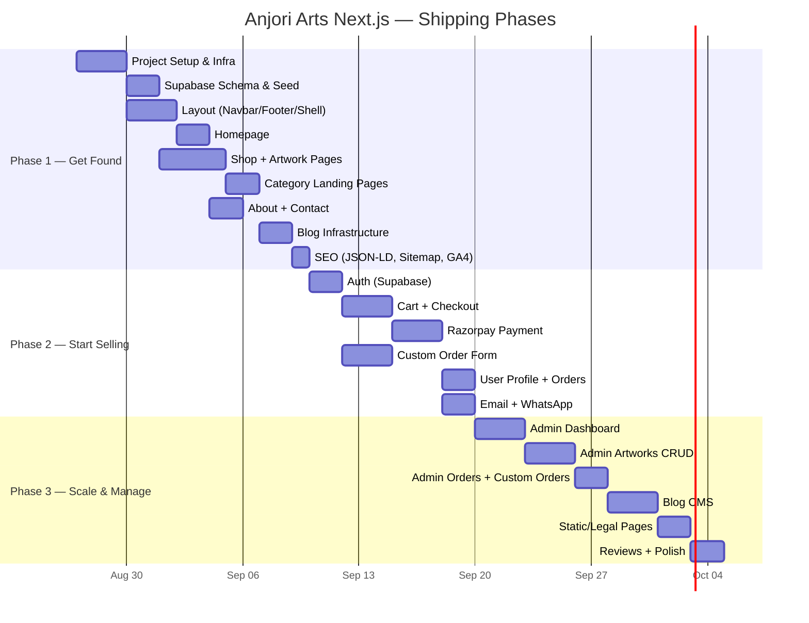

# UI Changes & Shipping Strategy

## Question 1: Do We Need UI Changes?

### Verdict: **KEEP & POLISH** — Don't Redesign From Scratch

Your existing UI is actually **well above average**. The code audit found genuinely impressive work:

### ✅ What's Already Great (Keep These Patterns)

| Area | What You Built | Quality |
|------|---------------|---------|
| **Mobile-First UX** | Touch swipe gestures on artwork gallery, bottom-sheet filter modals, ghost arrows that auto-fade, mobile drawer navigation | 🟢 Excellent |
| **Dark Mode** | Hand-tuned CSS variable tokens (`--aa-page`, `--aa-card`, `--aa-text`), autofill override, contrast-guarded chips | 🟢 Excellent |
| **Product Cards** | Size variants, art type/surface/medium chips, MRP + discount calc, dynamic cart state toggle | 🟢 Excellent |
| **Artwork View** | Desktop prev/next + thumbnails, mobile touch swipe (dx > 30), keyboard arrows, zoom modal, pagination dots | 🟢 Excellent |
| **Custom Order Form** | Multi-section modular cards, image cropper, country code dropdown, live char counter, cold-start detection | 🟢 Excellent |
| **Responsive Grids** | 2→4 col category grid, 1→2→3→4 col shop grid, asymmetric 70/30 featured splits | 🟢 Solid |
| **Page Shell** | Standardized `max-w-7xl` container, consistent spacing, Surface component for card containers | 🟢 Solid |

### 🔧 What Needs Polish (Not Redesign)

| Issue | Current State | Fix in New Build |
|-------|--------------|-----------------|
| **Color inconsistency** | Mixes `purple-600`, `#FF9F00`, `bg-blue-800` as primary CTAs | Standardize: Violet = brand/studio, Orange = purchase actions |
| **Too many fonts** | Loads 4 Google Fonts: Playfair, Quicksand, Great Vibes, Dancing Script. Only 2 actually used | Use `next/font` with just **Playfair Display** (headings) + **Poppins** (body) |
| **Component library** | Custom everything from scratch | Use **shadcn/ui** as foundation, customize to match your existing design tokens |
| **Inline styles** | Some `style={{ backgroundColor: "var(--aa-page)" }}` patterns | Move to Tailwind classes: `bg-[var(--aa-page)]` |
| **Hardcoded values** | `PAGE_SIZE = 1`, 12% GST hardcoded, price slider placeholder | Make configurable via env/database |

### 🎨 What This Means Practically

```
Old site design DNA  →  Port to Next.js with shadcn/ui components
                         ↓
Same look & feel     →  Better component primitives (accessible, consistent)
Same color tokens    →  Cleaned up & standardized  
Same responsive      →  Same breakpoints, same grids
Same interactions    →  Same framer-motion, same touch gestures
```

> [!TIP]
> Think of it as **renovation, not demolition**. Same house, better foundations, modern plumbing (SSR), and a fresh coat of paint (shadcn/ui).

---

## Question 2: What Pages Should We Ship First?

### Guiding Principle: **Ship what Google needs to see first**

Your #1 problem was "invisible to Google." So Phase 1 is purely about getting **indexable, SEO-rich pages** live. Transactions can come in Phase 2.

---

### 🏁 Phase 1 — "Get Found" (Week 1–2)

> [!IMPORTANT]  
> These pages start getting indexed by Google immediately. Every day without them is a day you're invisible.

| Page | Route | Why First | SEO Value |
|------|-------|-----------|-----------|
| **Homepage** | `/` | First impression + brand authority | Organization schema, hero keywords |
| **Shop / Catalog** | `/shop` | Browsable product listing with filters | Category pages rank for "buy X art online" |
| **Individual Artwork** | `/artworks/[slug]` | **THE most important page** — each artwork = unique indexable URL | Product schema, artwork-specific long-tail keywords |
| **Category Landing Pages** | `/categories/[slug]` | e.g. `/categories/madhubani-painting` | Rank for "Madhubani painting buy online" |
| **About / Artist Story** | `/about` | Trust + brand E-E-A-T signal for Google | Person/Organization schema |
| **Contact** | `/contact` | Trust signal + local SEO | LocalBusiness schema |
| **Blog (infrastructure)** | `/blog`, `/blog/[slug]` | Content marketing pipeline ready | Article schema, long-tail keywords |

**Phase 1 also includes (non-page infra):**
- ✅ Next.js project setup (App Router, TypeScript, Tailwind, shadcn/ui)
- ✅ Supabase schema + seed data (artworks, categories, art types)
- ✅ Cloudinary image integration with `next/image`
- ✅ SEO infrastructure (Metadata API, JSON-LD schemas, `next-sitemap`, `robots.txt`)
- ✅ Google Search Console submission
- ✅ Google Analytics 4 + Vercel Analytics
- ✅ Responsive layout (Navbar, Footer, PageShell)

**What a visitor can do after Phase 1:**
- Browse artworks, view details, read blog
- Contact via WhatsApp / form
- **Cannot** buy yet — but Google starts indexing immediately

---

### 💳 Phase 2 — "Start Selling" (Week 3–4)

| Page | Route | Why |
|------|-------|-----|
| **Auth** (Login/Signup) | `/login`, `/signup` | Supabase Auth with email + Google OAuth |
| **Cart** | `/cart` | Port existing cart UI |
| **Checkout** | `/checkout` | Address selection + order summary |
| **Razorpay Payment** | Payment flow | UPI, cards, wallets, netbanking |
| **Order Confirmation** | `/orders/[id]/confirmed` | Post-payment success + confetti 🎉 |
| **Custom Order Form** | `/custom-order` | Port the existing excellent form |
| **User Profile** | `/user/profile` | Profile, addresses, order history, wishlist |

**Phase 2 also includes:**
- ✅ Razorpay integration (server-side order creation + webhook verification)
- ✅ Resend email (order confirmation, shipping updates)
- ✅ WhatsApp order notification to admin
- ✅ GST invoice generation

**What a visitor can do after Phase 2:**
- Everything from Phase 1 + actually buy artwork + place custom orders

---

### 🛠️ Phase 3 — "Scale & Manage" (Week 5–6)

| Page | Route | Why |
|------|-------|-----|
| **Admin Dashboard** | `/admin` | Overview stats, recent orders |
| **Admin: Manage Artworks** | `/admin/artworks` | CRUD artworks with Cloudinary upload |
| **Admin: Manage Orders** | `/admin/orders` | Order status updates, tracking |
| **Admin: Custom Orders** | `/admin/custom-orders` | Review, quote, communicate |
| **Admin: Blog CMS** | `/admin/blog` | Create/edit blog posts (stored in DB, not hardcoded!) |
| **Static Pages** | `/shipping`, `/returns`, `/faq`, `/terms`, `/privacy`, `/care` | Legal & trust pages |
| **Share Experience** | `/share-experience` | Customer reviews with photos |

**Phase 3 also includes:**
- ✅ Blog CMS (admin writes in markdown, rendered via SSG/ISR)
- ✅ Review/testimonial system
- ✅ Shipping integration (Shiprocket or manual tracking)
- ✅ Performance optimization (image lazy loading, ISR for product pages)

---

## 📊 Phase Summary



> [!IMPORTANT]
> **Phase 1 should go live ASAP**, even without payment. Every day it's live, Google starts crawling and indexing your artwork pages. SEO results compound over time — the earlier you deploy, the earlier you rank.

---

## 🤔 Open Questions Before Implementation Plan

1. **Existing artwork data** — Do you have artwork data in the current PostgreSQL database that we need to migrate to Supabase? Or will you re-enter everything?
2. **Domain** — Will the new site replace anjoriarts.com on the same domain, or launch on a new one?
3. **Blog content** — Do you want to write blog posts in a rich editor in the admin panel, or is markdown sufficient?
4. **Gallery page** — Your sitemap lists `/gallery` but it doesn't exist in routes. Do you want a separate gallery (portfolio-style) distinct from the shop?
5. **Existing customers** — Any user accounts or order history that needs migration?

Once you confirm these + approve this phasing, I'll create the detailed implementation plan and we start building.
