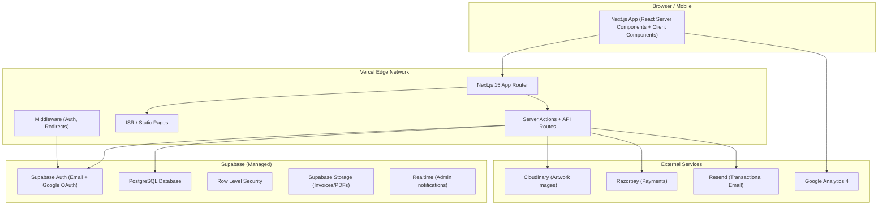
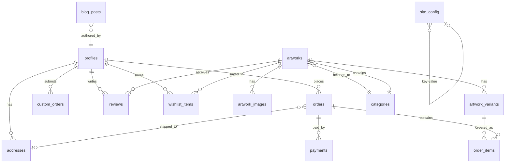
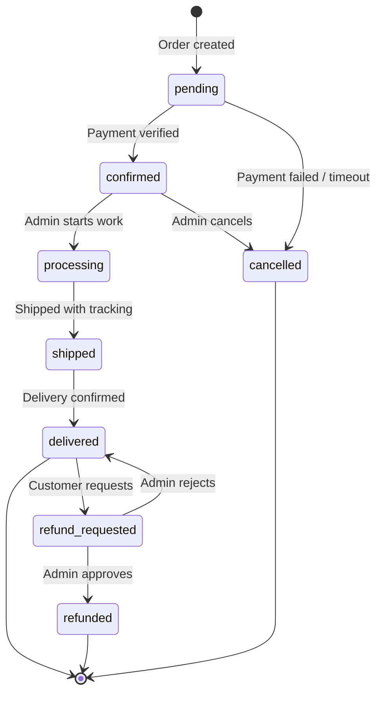
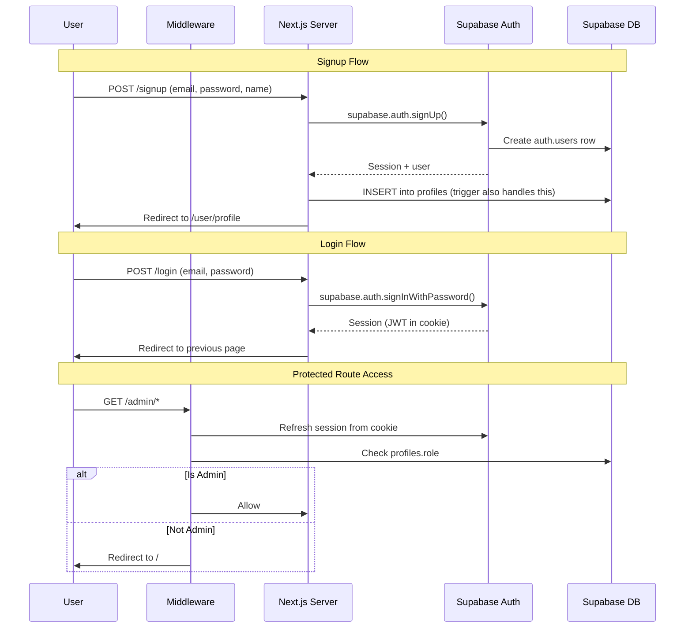
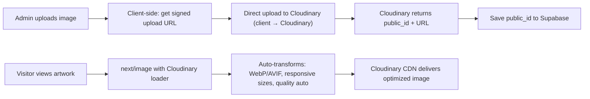
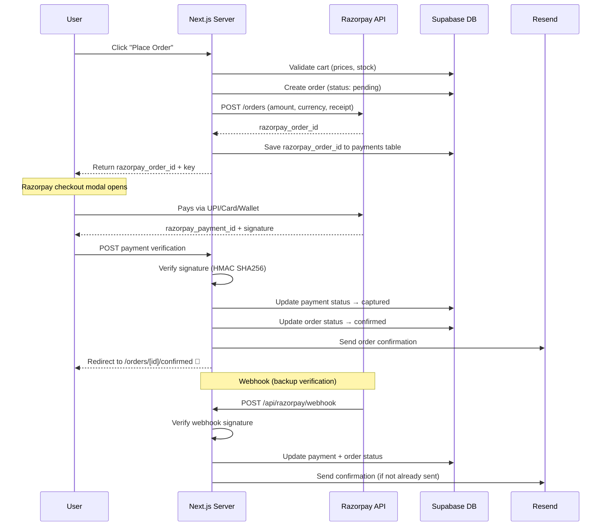
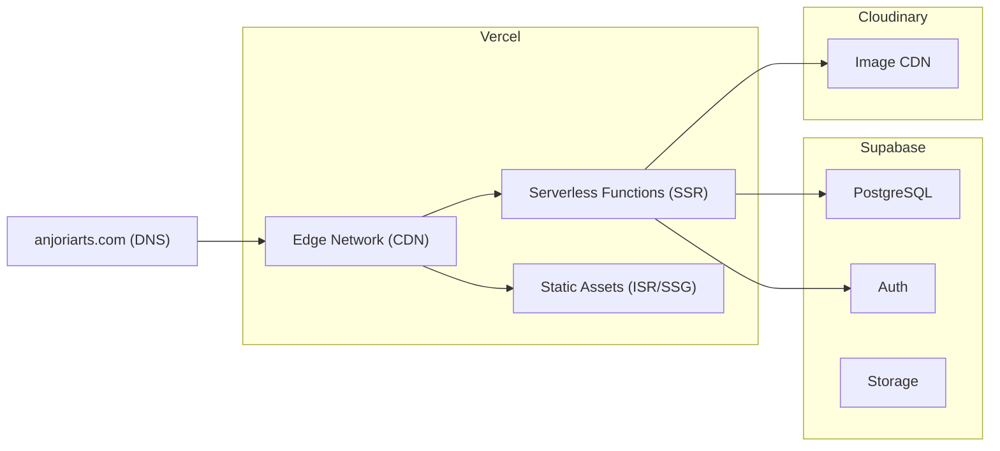

# 🏗️ Anjori Arts — System Design

## 1. High-Level Architecture



### Key Design Decisions

| Decision | Choice | Rationale |
|----------|--------|-----------|
| Rendering | **SSR + ISR** (not SPA) | Google sees full HTML; ISR revalidates on data change |
| Backend | **Next.js Server Actions** (no separate API server) | One deployment, no cold starts, type-safe end-to-end |
| Database | **Supabase PostgreSQL** | Managed Postgres, built-in auth, RLS, realtime |
| Image hosting | **Cloudinary** (not Supabase Storage) | Superior image transforms, auto WebP/AVIF, CDN |
| File storage | **Supabase Storage** | For invoices, PDFs, non-image files |
| Auth | **Supabase Auth** | Email/password + Google OAuth, session management, RLS integration |
| Payments | **Razorpay** | UPI, cards, wallets, netbanking — Indian market standard |
| State management | **Zustand** | Lightweight, for cart + UI state only |

---

## 2. Next.js App Router — Folder Structure

```
anjori-arts-next/
├── public/
│   ├── images/              # Static assets (hero, logos, icons)
│   ├── robots.txt           # Auto-generated by next-sitemap
│   └── sitemap.xml          # Auto-generated by next-sitemap
│
├── src/
│   ├── app/                 # App Router pages
│   │   ├── layout.tsx       # Root layout (fonts, navbar, footer, providers)
│   │   ├── page.tsx         # Homepage
│   │   ├── loading.tsx      # Global loading skeleton
│   │   ├── error.tsx        # Global error boundary
│   │   ├── not-found.tsx    # 404 page
│   │   │
│   │   ├── shop/
│   │   │   ├── page.tsx             # Shop listing (SSR + filters)
│   │   │   └── loading.tsx
│   │   │
│   │   ├── artworks/
│   │   │   └── [slug]/
│   │   │       ├── page.tsx         # Individual artwork (ISR)
│   │   │       └── loading.tsx
│   │   │
│   │   ├── categories/
│   │   │   └── [slug]/
│   │   │       └── page.tsx         # Category landing (ISR)
│   │   │
│   │   ├── custom-order/
│   │   │   └── page.tsx             # Custom order form
│   │   │
│   │   ├── blog/
│   │   │   ├── page.tsx             # Blog listing (ISR)
│   │   │   └── [slug]/
│   │   │       └── page.tsx         # Blog post (ISR)
│   │   │
│   │   ├── about/page.tsx
│   │   ├── contact/page.tsx
│   │   │
│   │   ├── cart/page.tsx            # Client-side (Zustand cart)
│   │   ├── checkout/page.tsx        # Auth-gated checkout
│   │   │
│   │   ├── (auth)/                  # Auth route group (no layout nesting)
│   │   │   ├── login/page.tsx
│   │   │   ├── signup/page.tsx
│   │   │   ├── forgot-password/page.tsx
│   │   │   └── reset-password/page.tsx
│   │   │
│   │   ├── user/                    # Auth-gated user area
│   │   │   ├── layout.tsx           # Sidebar layout
│   │   │   ├── profile/page.tsx
│   │   │   ├── addresses/page.tsx
│   │   │   ├── orders/page.tsx
│   │   │   ├── orders/[id]/page.tsx
│   │   │   └── wishlist/page.tsx
│   │   │
│   │   ├── admin/                   # Admin-gated area
│   │   │   ├── layout.tsx           # Admin sidebar layout
│   │   │   ├── page.tsx             # Dashboard overview
│   │   │   ├── artworks/
│   │   │   │   ├── page.tsx         # Manage artworks list
│   │   │   │   ├── new/page.tsx     # Add artwork
│   │   │   │   └── [id]/page.tsx    # Edit artwork
│   │   │   ├── orders/
│   │   │   │   ├── page.tsx
│   │   │   │   └── [id]/page.tsx
│   │   │   ├── custom-orders/
│   │   │   │   ├── page.tsx
│   │   │   │   └── [id]/page.tsx
│   │   │   └── blog/
│   │   │       ├── page.tsx         # Manage blog posts
│   │   │       ├── new/page.tsx
│   │   │       └── [id]/page.tsx
│   │   │
│   │   ├── (legal)/                 # Legal pages group
│   │   │   ├── shipping/page.tsx
│   │   │   ├── returns/page.tsx
│   │   │   ├── terms/page.tsx
│   │   │   ├── privacy/page.tsx
│   │   │   ├── faq/page.tsx
│   │   │   └── care/page.tsx
│   │   │
│   │   └── api/                     # API routes (webhooks only)
│   │       ├── razorpay/
│   │       │   └── webhook/route.ts # Razorpay payment webhook
│   │       └── revalidate/
│   │           └── route.ts         # On-demand ISR revalidation
│   │
│   ├── components/
│   │   ├── ui/                # shadcn/ui primitives
│   │   │   ├── button.tsx
│   │   │   ├── card.tsx
│   │   │   ├── dialog.tsx
│   │   │   ├── input.tsx
│   │   │   ├── select.tsx
│   │   │   ├── sheet.tsx      # Bottom sheet / side panel
│   │   │   ├── skeleton.tsx
│   │   │   ├── badge.tsx
│   │   │   ├── toast.tsx
│   │   │   └── ...
│   │   │
│   │   ├── layout/
│   │   │   ├── navbar/
│   │   │   │   ├── Navbar.tsx          # Server component shell
│   │   │   │   ├── DesktopNav.tsx      # Desktop navigation
│   │   │   │   ├── MobileNav.tsx       # Mobile drawer
│   │   │   │   ├── CartIcon.tsx        # Client: cart count badge
│   │   │   │   ├── ThemeToggle.tsx     # Client: dark/light
│   │   │   │   └── UserMenu.tsx        # Client: dropdown
│   │   │   ├── Footer.tsx
│   │   │   └── PageShell.tsx
│   │   │
│   │   ├── shared/
│   │   │   ├── ArtworkCard.tsx         # Product card (shop, home, related)
│   │   │   ├── ArtworkGrid.tsx         # Responsive grid wrapper
│   │   │   ├── PriceDisplay.tsx        # MRP + discount + effective
│   │   │   ├── ImageGallery.tsx        # Swipe + zoom + thumbnails
│   │   │   ├── SectionHeading.tsx      # Consistent section titles
│   │   │   ├── FilterSheet.tsx         # Mobile bottom sheet / desktop sidebar
│   │   │   ├── Breadcrumbs.tsx         # Auto breadcrumbs with schema
│   │   │   ├── EmptyState.tsx          # Empty cart, no results
│   │   │   ├── WhatsAppCTA.tsx         # Floating WhatsApp button
│   │   │   ├── StarRating.tsx          # Star display + input
│   │   │   └── LoadingButton.tsx       # Button with spinner state
│   │   │
│   │   ├── seo/
│   │   │   ├── JsonLd.tsx              # Product, Article, Org schemas
│   │   │   └── generateMetadata.ts     # Shared metadata helpers
│   │   │
│   │   └── forms/
│   │       ├── AddressForm.tsx
│   │       ├── PhoneInput.tsx
│   │       └── ImageUploader.tsx
│   │
│   ├── lib/
│   │   ├── supabase/
│   │   │   ├── client.ts       # Browser client (for client components)
│   │   │   ├── server.ts       # Server client (for RSC / server actions)
│   │   │   ├── admin.ts        # Service role client (for webhooks)
│   │   │   └── middleware.ts   # Auth session refresh
│   │   ├── cloudinary.ts       # Upload + URL builder + blur hash
│   │   ├── razorpay.ts         # Order creation + verification
│   │   ├── resend.ts           # Email templates + send
│   │   └── utils.ts            # Formatters, slug generators, etc.
│   │
│   ├── actions/                # Server Actions (type-safe mutations)
│   │   ├── artwork.ts          # CRUD artworks
│   │   ├── order.ts            # Create order, update status
│   │   ├── custom-order.ts     # Submit custom order
│   │   ├── cart.ts             # Server-validated cart operations
│   │   ├── auth.ts             # Login, signup, logout
│   │   ├── user.ts             # Profile, addresses
│   │   ├── blog.ts             # CRUD blog posts
│   │   ├── review.ts           # Submit/manage reviews
│   │   ├── wishlist.ts         # Add/remove wishlist
│   │   └── contact.ts          # Contact form submission
│   │
│   ├── queries/                # Data fetching functions (read-only)
│   │   ├── artworks.ts         # getArtworks, getArtworkBySlug, etc.
│   │   ├── categories.ts
│   │   ├── orders.ts
│   │   ├── blog.ts
│   │   └── admin.ts            # Dashboard stats
│   │
│   ├── stores/                 # Zustand stores (client-side only)
│   │   ├── cart-store.ts       # Cart items, quantities
│   │   └── ui-store.ts         # Modals, mobile menu, filters
│   │
│   ├── types/
│   │   ├── database.ts         # Auto-generated from Supabase (supabase gen types)
│   │   ├── artwork.ts
│   │   ├── order.ts
│   │   └── ...
│   │
│   ├── config/
│   │   ├── site.ts             # Site name, description, URLs
│   │   ├── navigation.ts       # Nav links config
│   │   └── constants.ts        # GST rate, page sizes, etc.
│   │
│   └── styles/
│       ├── globals.css         # Tailwind directives + CSS tokens
│       └── theme.css           # --aa-* custom properties (light/dark)
│
├── supabase/
│   ├── migrations/             # Database migrations
│   └── seed.sql                # Seed data
│
├── next.config.ts
├── tailwind.config.ts
├── tsconfig.json
├── middleware.ts               # Auth session refresh + route protection
├── next-sitemap.config.js
└── package.json
```

---

## 3. Database Schema (Supabase PostgreSQL)



### Table Definitions

#### `profiles` (extends Supabase Auth users)
| Column | Type | Notes |
|--------|------|-------|
| `id` | `uuid` PK | References `auth.users.id` |
| `full_name` | `text` | |
| `phone` | `text` | |
| `country_code` | `text` | Default `+91` |
| `avatar_url` | `text` | Cloudinary URL |
| `role` | `enum('customer', 'admin')` | Default `customer` |
| `created_at` | `timestamptz` | |
| `updated_at` | `timestamptz` | |

#### `addresses`
| Column | Type | Notes |
|--------|------|-------|
| `id` | `uuid` PK | |
| `user_id` | `uuid` FK → profiles | |
| `label` | `text` | "Home", "Office", etc. |
| `full_name` | `text` | Recipient name |
| `phone` | `text` | |
| `address_line_1` | `text` | |
| `address_line_2` | `text` | |
| `city` | `text` | |
| `state` | `text` | |
| `pincode` | `text` | |
| `is_default` | `boolean` | |
| `created_at` | `timestamptz` | |

#### `categories`
| Column | Type | Notes |
|--------|------|-------|
| `id` | `uuid` PK | |
| `name` | `text` | "Paintings", "Earrings", "Wall Decor" |
| `slug` | `text` UNIQUE | `paintings`, `earrings` |
| `description` | `text` | SEO description |
| `image_url` | `text` | Category hero image |
| `display_order` | `int` | Sort order |
| `is_active` | `boolean` | |
| `created_at` | `timestamptz` | |

#### `artworks`
| Column | Type | Notes |
|--------|------|-------|
| `id` | `uuid` PK | |
| `title` | `text` | "Madhubani Fish Motif Painting" |
| `slug` | `text` UNIQUE | `madhubani-fish-motif-painting` |
| `description` | `text` | Rich description for SEO |
| `short_description` | `text` | Card preview text |
| `category_id` | `uuid` FK → categories | |
| `art_type` | `enum` | `madhubani`, `tanjore`, `modern`, `classical`, `warli`, `kalamkari`, `other` |
| `surface` | `enum` | `canvas`, `paper`, `silk`, `wood`, `metal`, `fabric`, `other` |
| `medium` | `enum` | `acrylic`, `watercolor`, `oil`, `ink`, `mixed_media`, `natural_dyes`, `gold_leaf`, `other` |
| `artist_note` | `text` | Personal note from artist |
| `is_featured` | `boolean` | Show on homepage |
| `is_active` | `boolean` | Visible in shop |
| `is_custom_available` | `boolean` | Can be customized |
| `tags` | `text[]` | Postgres array — `['diwali', 'gift', 'traditional']` |
| `seo_title` | `text` | Override for `<title>` tag |
| `seo_description` | `text` | Override for meta description |
| `created_at` | `timestamptz` | |
| `updated_at` | `timestamptz` | |

#### `artwork_images`
| Column | Type | Notes |
|--------|------|-------|
| `id` | `uuid` PK | |
| `artwork_id` | `uuid` FK → artworks | |
| `cloudinary_public_id` | `text` | For transforms & deletion |
| `url` | `text` | Full Cloudinary URL |
| `alt_text` | `text` | SEO alt text |
| `blur_data_url` | `text` | Base64 blur placeholder |
| `display_order` | `int` | |
| `is_primary` | `boolean` | Main image for cards/OG |

#### `artwork_variants` (size + pricing)
| Column | Type | Notes |
|--------|------|-------|
| `id` | `uuid` PK | |
| `artwork_id` | `uuid` FK → artworks | |
| `label` | `text` | "Small", "Medium", "Large", "XL" |
| `width_inches` | `decimal` | |
| `height_inches` | `decimal` | |
| `mrp` | `int` | In paise (₹1500 = 150000) |
| `selling_price` | `int` | In paise |
| `stock_quantity` | `int` | -1 = made to order |
| `is_active` | `boolean` | |
| `display_order` | `int` | |

> [!IMPORTANT]
> **All prices stored in paise** (smallest currency unit). ₹1,500 = `150000`. This prevents floating-point errors and matches Razorpay's expected format.

#### `orders`
| Column | Type | Notes |
|--------|------|-------|
| `id` | `uuid` PK | |
| `order_number` | `text` UNIQUE | Human-readable: `AA-20260827-001` |
| `user_id` | `uuid` FK → profiles | Nullable for guest checkout |
| `guest_email` | `text` | For guest orders |
| `address_snapshot` | `jsonb` | Frozen copy of shipping address |
| `subtotal` | `int` | In paise |
| `cgst` | `int` | In paise |
| `sgst` | `int` | In paise |
| `delivery_charge` | `int` | In paise |
| `total` | `int` | In paise |
| `status` | `enum` | See order lifecycle below |
| `tracking_number` | `text` | Shipping tracking |
| `tracking_url` | `text` | |
| `notes` | `text` | Internal admin notes |
| `created_at` | `timestamptz` | |
| `updated_at` | `timestamptz` | |

**Order Status Lifecycle:**


#### `order_items`
| Column | Type | Notes |
|--------|------|-------|
| `id` | `uuid` PK | |
| `order_id` | `uuid` FK → orders | |
| `artwork_variant_id` | `uuid` FK → artwork_variants | |
| `artwork_snapshot` | `jsonb` | Frozen: title, image, art_type, size, price at time of purchase |
| `quantity` | `int` | |
| `unit_price` | `int` | Price at time of order (paise) |
| `total_price` | `int` | quantity × unit_price |

> [!NOTE]
> **Why snapshot?** If you edit an artwork's title or price later, existing orders must show what the customer actually bought. `artwork_snapshot` freezes that data.

#### `payments`
| Column | Type | Notes |
|--------|------|-------|
| `id` | `uuid` PK | |
| `order_id` | `uuid` FK → orders | |
| `razorpay_order_id` | `text` | From Razorpay API |
| `razorpay_payment_id` | `text` | After successful payment |
| `razorpay_signature` | `text` | For verification |
| `amount` | `int` | In paise |
| `currency` | `text` | `INR` |
| `status` | `enum` | `created`, `authorized`, `captured`, `failed`, `refunded` |
| `method` | `text` | `upi`, `card`, `netbanking`, `wallet` |
| `created_at` | `timestamptz` | |

#### `custom_orders`
| Column | Type | Notes |
|--------|------|-------|
| `id` | `uuid` PK | |
| `order_number` | `text` UNIQUE | `CO-20260827-001` |
| `user_id` | `uuid` FK → profiles | Nullable |
| `name` | `text` | |
| `email` | `text` | |
| `phone` | `text` | |
| `country_code` | `text` | |
| `art_type` | `text` | Preferred art type |
| `surface` | `text` | |
| `medium` | `text` | |
| `size_description` | `text` | Free text ("12x16 inches" or "A3 size") |
| `description` | `text` | What they want |
| `reference_images` | `text[]` | Cloudinary URLs |
| `artist_choice` | `boolean` | Let artist decide details |
| `budget_min` | `int` | Paise |
| `budget_max` | `int` | Paise |
| `status` | `enum` | `submitted`, `reviewed`, `quoted`, `accepted`, `in_progress`, `completed`, `cancelled` |
| `admin_notes` | `text` | |
| `quoted_price` | `int` | Paise |
| `created_at` | `timestamptz` | |
| `updated_at` | `timestamptz` | |

#### `reviews`
| Column | Type | Notes |
|--------|------|-------|
| `id` | `uuid` PK | |
| `artwork_id` | `uuid` FK → artworks | |
| `user_id` | `uuid` FK → profiles | |
| `rating` | `int` | 1–5 |
| `title` | `text` | |
| `body` | `text` | |
| `images` | `text[]` | Cloudinary URLs |
| `is_verified_purchase` | `boolean` | Auto-set if user bought this |
| `is_approved` | `boolean` | Admin moderation |
| `created_at` | `timestamptz` | |

#### `wishlist_items`
| Column | Type | Notes |
|--------|------|-------|
| `id` | `uuid` PK | |
| `user_id` | `uuid` FK → profiles | |
| `artwork_id` | `uuid` FK → artworks | |
| `created_at` | `timestamptz` | |
| **UNIQUE** | `(user_id, artwork_id)` | Prevent duplicates |

#### `blog_posts`
| Column | Type | Notes |
|--------|------|-------|
| `id` | `uuid` PK | |
| `title` | `text` | |
| `slug` | `text` UNIQUE | |
| `excerpt` | `text` | Preview text for listing/SEO |
| `content` | `text` | Markdown content |
| `cover_image_url` | `text` | Cloudinary |
| `cover_image_alt` | `text` | |
| `author_id` | `uuid` FK → profiles | |
| `tags` | `text[]` | |
| `seo_title` | `text` | |
| `seo_description` | `text` | |
| `is_published` | `boolean` | |
| `published_at` | `timestamptz` | |
| `created_at` | `timestamptz` | |
| `updated_at` | `timestamptz` | |

#### `contact_submissions`
| Column | Type | Notes |
|--------|------|-------|
| `id` | `uuid` PK | |
| `name` | `text` | |
| `email` | `text` | |
| `phone` | `text` | |
| `subject` | `text` | |
| `message` | `text` | |
| `is_read` | `boolean` | Admin tracking |
| `created_at` | `timestamptz` | |

#### `site_config` (key-value settings)
| Column | Type | Notes |
|--------|------|-------|
| `key` | `text` PK | `gst_rate`, `delivery_charge`, `free_delivery_threshold`, `announcement_text` |
| `value` | `jsonb` | Flexible value storage |
| `updated_at` | `timestamptz` | |

---

## 4. Authentication Flow



### Auth Strategy
- **Supabase Auth** manages sessions via HTTP-only cookies (not localStorage)
- **Middleware** (`middleware.ts`) refreshes the session on every request and protects `/admin/*` and `/user/*` routes
- **Database trigger** auto-creates a `profiles` row when a new `auth.users` row is created
- **RLS policies** use `auth.uid()` to scope data access
- **Google OAuth** as optional social login

---

## 5. Server Actions — API Design

> [!NOTE]
> We use **Server Actions** (not API routes) for all mutations. API routes are only for external webhooks (Razorpay). This gives us type-safety, automatic revalidation, and progressive enhancement (forms work without JS).

### Action Pattern
```typescript
// src/actions/artwork.ts
"use server"

import { createServerClient } from "@/lib/supabase/server"
import { revalidatePath } from "next/cache"
import { z } from "zod"

const CreateArtworkSchema = z.object({
  title: z.string().min(3).max(200),
  description: z.string().min(10),
  category_id: z.string().uuid(),
  art_type: z.enum(["madhubani", "tanjore", "modern", ...]),
  // ... all fields validated
})

export async function createArtwork(formData: FormData) {
  const supabase = await createServerClient()
  
  // 1. Verify admin role
  const { data: { user } } = await supabase.auth.getUser()
  if (!user) throw new Error("Unauthorized")
  
  // 2. Validate input
  const parsed = CreateArtworkSchema.safeParse(Object.fromEntries(formData))
  if (!parsed.success) return { error: parsed.error.flatten() }
  
  // 3. Generate slug
  const slug = generateSlug(parsed.data.title)
  
  // 4. Insert
  const { data, error } = await supabase
    .from("artworks")
    .insert({ ...parsed.data, slug })
    .select()
    .single()
  
  // 5. Revalidate cached pages
  revalidatePath("/shop")
  revalidatePath(`/artworks/${slug}`)
  
  return { data }
}
```

### Actions Inventory

| File | Actions | Used By |
|------|---------|---------|
| `artwork.ts` | `createArtwork`, `updateArtwork`, `deleteArtwork`, `toggleFeatured` | Admin |
| `order.ts` | `createOrder`, `updateOrderStatus`, `addTracking` | Checkout, Admin |
| `custom-order.ts` | `submitCustomOrder`, `updateCustomOrderStatus`, `setQuote` | Custom form, Admin |
| `cart.ts` | `validateCart` (server-side price verification before checkout) | Checkout |
| `auth.ts` | `signUp`, `signIn`, `signOut`, `resetPassword` | Auth pages |
| `user.ts` | `updateProfile`, `addAddress`, `updateAddress`, `deleteAddress` | User pages |
| `blog.ts` | `createPost`, `updatePost`, `deletePost`, `togglePublish` | Admin |
| `review.ts` | `submitReview`, `approveReview`, `deleteReview` | Artwork page, Admin |
| `wishlist.ts` | `toggleWishlist` | Artwork cards |
| `contact.ts` | `submitContactForm` | Contact page |
| `upload.ts` | `getCloudinarySignature` | Image uploaders |

---

## 6. Image Pipeline (Cloudinary)



### Cloudinary Loader for next/image
```typescript
// src/lib/cloudinary.ts
export function cloudinaryLoader({ src, width, quality }: {
  src: string; width: number; quality?: number
}) {
  const params = [
    `w_${width}`,
    `q_${quality || "auto"}`,
    "f_auto",          // Auto WebP/AVIF
    "c_limit",         // Don't upscale
    "dpr_auto",        // Retina support
  ].join(",")
  
  // src = cloudinary public_id
  return `https://res.cloudinary.com/${CLOUD_NAME}/image/upload/${params}/${src}`
}
```

### Image Sizes Served
| Context | Sizes | Format |
|---------|-------|--------|
| Artwork card thumbnail | 400w, 600w | WebP/AVIF |
| Artwork gallery main | 800w, 1200w, 1600w | WebP/AVIF |
| Artwork gallery thumbnail | 100w, 150w | WebP/AVIF |
| Hero banner | 1200w, 1920w | WebP/AVIF |
| OG image (social share) | 1200×630 | JPG (max compatibility) |
| Blog cover | 800w, 1200w | WebP/AVIF |
| Blur placeholder | 10w | Base64 inline |

---

## 7. Payment Flow (Razorpay)



> [!IMPORTANT]
> **Dual verification:** Client-side callback + server-side webhook. The webhook is the source of truth — it fires even if the user closes the browser after payment.

---

## 8. Email System (Resend)

| Trigger | Template | Recipient |
|---------|----------|-----------|
| Order confirmed | Order details, items, total, tracking link placeholder | Customer |
| Order shipped | Tracking number + link | Customer |
| Order delivered | Review request + care instructions | Customer |
| Custom order received | Acknowledgment + expected timeline | Customer |
| Custom order quoted | Quote details + accept/reject CTA | Customer |
| Password reset | Reset link (Supabase handles this via Resend SMTP) | Customer |
| New order notification | Order summary | Admin (WhatsApp + Email) |
| Contact form received | Form details | Admin |

### Email Architecture
- **React Email** templates (JSX → HTML) for beautiful, branded emails
- **Resend** as the delivery service
- All emails sent from `noreply@anjoriarts.com` (custom domain verified in Resend)

---

## 9. SEO Architecture

### Per-Page Metadata (Next.js Metadata API)
```typescript
// src/app/artworks/[slug]/page.tsx
export async function generateMetadata({ params }): Promise<Metadata> {
  const artwork = await getArtworkBySlug(params.slug)
  const primaryImage = artwork.images.find(i => i.is_primary)

  return {
    title: artwork.seo_title || `${artwork.title} | Anjori Arts`,
    description: artwork.seo_description || artwork.short_description,
    openGraph: {
      title: artwork.title,
      description: artwork.short_description,
      images: [{ url: primaryImage.url, width: 1200, height: 630 }],
      type: "product",
    },
    alternates: {
      canonical: `https://www.anjoriarts.com/artworks/${artwork.slug}`,
    },
  }
}
```

### JSON-LD Structured Data Per Page

| Page | Schema Types |
|------|-------------|
| Homepage | `Organization`, `WebSite`, `SearchAction` |
| Shop listing | `CollectionPage`, `ItemList` of `Product` |
| Artwork detail | `Product` with `Offer`, `AggregateRating`, `Review`, `BreadcrumbList` |
| Category page | `CollectionPage`, `BreadcrumbList` |
| Blog post | `Article`, `BreadcrumbList`, `Person` (author) |
| About page | `Organization`, `Person` (artist) |
| Contact page | `LocalBusiness`, `ContactPoint` |
| FAQ page | `FAQPage` with `Question`/`Answer` |

### Auto-Generated Sitemap
```javascript
// next-sitemap.config.js
module.exports = {
  siteUrl: "https://www.anjoriarts.com",
  generateRobotsTxt: true,
  exclude: ["/admin/*", "/user/*", "/cart", "/checkout"],
  additionalPaths: async (config) => {
    // Fetch all artwork slugs from Supabase
    const artworks = await getAllArtworkSlugs()
    const categories = await getAllCategorySlugs()
    const blogPosts = await getAllBlogSlugs()
    
    return [
      ...artworks.map(slug => ({ loc: `/artworks/${slug}`, priority: 0.8, changefreq: "weekly" })),
      ...categories.map(slug => ({ loc: `/categories/${slug}`, priority: 0.9, changefreq: "weekly" })),
      ...blogPosts.map(slug => ({ loc: `/blog/${slug}`, priority: 0.7, changefreq: "monthly" })),
    ]
  }
}
```

---

## 10. Core Web Vitals Strategy

### Rendering Strategy Per Route

| Route | Strategy | Why |
|-------|----------|-----|
| `/` (Homepage) | **ISR** (revalidate: 3600) | Content changes rarely, needs to be fast |
| `/shop` | **SSR** (dynamic) | Filters/search change per request |
| `/artworks/[slug]` | **ISR** (revalidate: 3600, on-demand) | Static for speed, revalidated on admin edit |
| `/categories/[slug]` | **ISR** (revalidate: 3600) | Static category pages |
| `/blog/[slug]` | **ISR** (revalidate: 86400) | Blog rarely changes |
| `/cart` | **Client-side** | Zustand store, no server data |
| `/checkout` | **SSR** (dynamic, auth-gated) | Needs real-time price verification |
| `/admin/*` | **SSR** (dynamic, auth-gated) | Always fresh data |
| `/user/*` | **SSR** (dynamic, auth-gated) | User-specific data |
| Legal pages | **SSG** (static) | Never changes |

### Performance Checklist (Baked Into Architecture)

| Technique | Impact | Implementation |
|-----------|--------|---------------|
| React Server Components | 🟢 Less JS shipped | Default for all pages; `"use client"` only for interactive parts |
| `next/image` + Cloudinary | 🟢 LCP | Lazy load, blur placeholder, responsive srcset, WebP/AVIF |
| `next/font` | 🟢 CLS | Self-hosted fonts, `display: swap`, `size-adjust` fallback |
| Streaming + Suspense | 🟢 TTFB | Shell renders immediately, data streams in |
| `loading.tsx` skeletons | 🟢 CLS | Exact layout preserved during load |
| Route prefetching | 🟢 Navigation | `<Link>` auto-prefetches on viewport |
| ISR | 🟢 TTFB | Pre-built pages served from CDN edge |
| Dynamic imports | 🟢 Bundle size | `next/dynamic` for modals, image gallery, rich editor |
| Minimal client JS | 🟢 INP | Only cart, theme, filters, gallery need client JS |
| No external CSS CDNs | 🟢 Render blocking | Tailwind compiled, no Google Fonts CDN |
| Metadata API | 🟢 SEO | Server-rendered `<head>` with unique meta per page |

---

## 11. Security Model

### Row Level Security (RLS) — Supabase

```sql
-- Customers can only read their own profile
CREATE POLICY "Users read own profile" ON profiles
  FOR SELECT USING (auth.uid() = id);

-- Customers can only read their own orders
CREATE POLICY "Users read own orders" ON orders
  FOR SELECT USING (auth.uid() = user_id);

-- Anyone can read active artworks (public catalog)
CREATE POLICY "Public read active artworks" ON artworks
  FOR SELECT USING (is_active = true);

-- Only admins can insert/update/delete artworks
CREATE POLICY "Admins manage artworks" ON artworks
  FOR ALL USING (
    EXISTS (SELECT 1 FROM profiles WHERE id = auth.uid() AND role = 'admin')
  );

-- Only admins can read all orders
CREATE POLICY "Admins read all orders" ON orders
  FOR SELECT USING (
    EXISTS (SELECT 1 FROM profiles WHERE id = auth.uid() AND role = 'admin')
  );
```

### Other Security Measures

| Layer | Protection |
|-------|-----------|
| **Input validation** | Zod schemas on every Server Action |
| **CSRF** | Next.js Server Actions have built-in CSRF protection |
| **Auth cookies** | HTTP-only, Secure, SameSite=Lax (Supabase default) |
| **Razorpay verification** | HMAC SHA256 signature verification on both client callback and webhook |
| **Rate limiting** | On contact form, custom order, auth endpoints (via middleware or Vercel WAF) |
| **Image uploads** | Signed Cloudinary uploads (server generates signature, client uploads directly) |
| **SQL injection** | Supabase client uses parameterized queries |
| **XSS** | React auto-escapes, Content-Security-Policy headers |
| **Admin routes** | Middleware checks `profiles.role = 'admin'` before allowing access |

---

## 12. Deployment Architecture



### Environment Variables

```bash
# Supabase
NEXT_PUBLIC_SUPABASE_URL=
NEXT_PUBLIC_SUPABASE_ANON_KEY=
SUPABASE_SERVICE_ROLE_KEY=          # Server-only, never exposed

# Cloudinary
NEXT_PUBLIC_CLOUDINARY_CLOUD_NAME=
CLOUDINARY_API_KEY=
CLOUDINARY_API_SECRET=              # Server-only

# Razorpay
NEXT_PUBLIC_RAZORPAY_KEY_ID=
RAZORPAY_KEY_SECRET=                # Server-only
RAZORPAY_WEBHOOK_SECRET=            # Server-only

# Resend
RESEND_API_KEY=                     # Server-only

# Site
NEXT_PUBLIC_SITE_URL=https://www.anjoriarts.com

# Analytics
NEXT_PUBLIC_GA_MEASUREMENT_ID=
```

> [!WARNING]
> Variables prefixed with `NEXT_PUBLIC_` are exposed to the browser. **Never** prefix secret keys with `NEXT_PUBLIC_`.

---

## 13. Cart Architecture (Zustand — Client-Side)

```typescript
// src/stores/cart-store.ts
interface CartItem {
  artworkId: string
  variantId: string
  quantity: number
  // Snapshot for display (no server call needed to render cart)
  title: string
  imageUrl: string
  size: string
  sellingPrice: number   // paise
  mrp: number            // paise
}

interface CartStore {
  items: CartItem[]
  addItem: (item: CartItem) => void
  removeItem: (variantId: string) => void
  updateQuantity: (variantId: string, qty: number) => void
  clearCart: () => void
  totalItems: () => number
  subtotal: () => number
}
```

### Cart Flow
1. **Add to cart** → Zustand store (persisted to `localStorage`)
2. **View cart** → Read from Zustand, render client-side
3. **Checkout** → Server Action `validateCart()` re-fetches prices from DB and verifies stock
4. **Price mismatch?** → Show updated prices, ask user to confirm
5. **Create order** → Server-side only (never trust client prices)

> [!IMPORTANT]
> Cart is client-side for instant UX, but **checkout always validates prices server-side**. Never trust client-sent prices for payment.

---

## 14. Monitoring & Analytics

| Tool | Purpose | Cost |
|------|---------|------|
| **Vercel Analytics** | Web Vitals (LCP, CLS, INP), page views | Free tier |
| **Google Analytics 4** | Traffic sources, user behavior, conversions | Free |
| **Google Search Console** | Index status, search queries, crawl issues | Free |
| **Sentry** (optional) | Error tracking, performance monitoring | Free tier |
| **Supabase Dashboard** | Database metrics, auth stats, API usage | Included |

---

## Summary: What Talks to What

```
┌─────────────────────────────────────────────────────────┐
│                    USER'S BROWSER                        │
│  ┌──────────┐  ┌──────────┐  ┌───────────┐             │
│  │ Zustand   │  │ shadcn   │  │ Framer    │             │
│  │ Cart      │  │ UI       │  │ Motion    │             │
│  └──────────┘  └──────────┘  └───────────┘             │
│         ↕ Server Actions                                 │
└─────────────────────────────────────────────────────────┘
                        ↕ HTTPS
┌─────────────────────────────────────────────────────────┐
│              NEXT.JS ON VERCEL                           │
│  ┌──────────────┐  ┌──────────┐  ┌──────────┐          │
│  │ Server       │  │ API      │  │ Middleware│          │
│  │ Components   │  │ Routes   │  │ (Auth)   │          │
│  │ + Actions    │  │ (Webhook)│  │          │          │
│  └──────┬───────┘  └────┬─────┘  └──────────┘          │
└─────────┼───────────────┼───────────────────────────────┘
          ↓               ↓
   ┌──────┴───────────────┴──────┐
   │       SUPABASE              │
   │  ┌────────┐  ┌──────────┐   │
   │  │ Auth   │  │ Postgres │   │
   │  └────────┘  └──────────┘   │
   └─────────────────────────────┘
          ↕               ↕
   ┌────────────┐  ┌────────────┐  ┌──────────┐
   │ Cloudinary │  │ Razorpay   │  │ Resend   │
   │ (Images)   │  │ (Payments) │  │ (Email)  │
   └────────────┘  └────────────┘  └──────────┘
```
